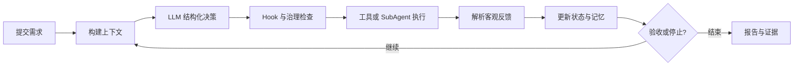

# Code-Agent

当前实现包含核心循环、治理策略、workspace 工具、反馈、Mock LLM、记忆、Hook、SubAgent、SQLite、FastAPI、CLI、TUI 和 WebUI 最小可运行骨架。开发验证使用 Mock LLM，不依赖真实 API Key。

Code-Agent 是一个面向本地代码仓库的通用编码助手，也是 AI4SE 期末项目 A：Coding Agent Harness。

用户可以用自然语言描述需求，由 Agent 在指定 workspace 中理解项目、修改代码、执行命令、运行验证，并根据测试、Lint、类型检查和构建反馈持续调整。项目不依赖现成的高层 Agent Runner，核心主循环、工具分发、治理、反馈、记忆与 SubAgent 调度均由本仓库自行实现。

> 当前处于规格设计完成、实现尚未开始的阶段。本文中的安装命令和交互界面是首版目标，不代表目前已经可以运行。完整设计见 [SPEC.md](SPEC.md)。

## 项目定位

Code-Agent 不是只处理示例 Bug 的修复工具，而是面向小到中等规模开发任务的完整编码助手。首版计划支持：

- 根据自然语言需求实现功能。
- 修复 Bug，并依据客观失败反馈迭代。
- 阅读和解释代码、补充测试、执行小型重构。
- 创建、修改和删除项目文件。
- 执行 Shell、测试、Lint、类型检查和构建命令。
- 通过 Shell 完成常见 Git 操作，并对高风险命令进行治理。
- 使用 TUI、非交互 CLI 和 React WebUI 启动、观察和审批任务。
- 通过受控 SubAgent 完成探索、实现、验证和评审。

## 核心设计

项目的主要贡献由两个互相配合的方向组成：

1. **受治理的工程化反馈循环**：用代码实现 LoopSpec、Policy Engine、人工审批、Hook、验证器、恢复策略、预算和停止条件。
2. **轻量结构化项目记忆与上下文工程**：按任务、路径和失败类型检索项目规则、历史决策与已验证经验，不使用重型向量 RAG。

一次任务的主要流程为：



LLM 可以提出下一步动作或声明任务完成，但不能自行判定成功。只有用户定义的验收命令或确定性检查通过，任务才能进入 `succeeded`；缺少客观验证时进入 `needs_review`。

## Loop Engineering

每个任务使用显式 `LoopSpec`，至少包含：

- 任务目标与验收命令。
- 最大轮次、运行时间和调用预算。
- 失败恢复与重复失败策略。
- 必须人工介入的节点。
- 成功、待复核、阻塞、失败、预算耗尽和取消等终止状态。

循环遵循“感知 → 决策 → 治理 → 执行 → 验证 → 反思 → 记录”，并将运行状态持久化到 SQLite，以支持中断恢复。

## 权限模式

所有动作执行前都必须经过代码实现的 Policy Engine。Prompt、Hook、LLM 和 Auto 模式均不能绕过硬性安全规则。

| 动作 | Plan | Supervised（默认） | Auto |
|---|---|---|---|
| 读取、搜索、Git diff | 自动 | 自动 | 自动 |
| 修改 workspace 文件 | 禁止 | 自动 | 自动 |
| 已配置的测试与构建 | 禁止 | 自动 | 自动 |
| 普通 Shell | 禁止 | 审批 | 自动 |
| Agent 通用联网 | 禁止 | 审批 | 自动 |
| 安装或升级依赖 | 禁止 | 审批 | 自动 |
| 删除文件、Git commit | 禁止 | 审批 | 审批 |
| 越界访问、读取凭据、破坏系统、强推 | 禁止 | 禁止 | 禁止 |

审批支持“仅此次允许”和“本任务内允许同类动作”，授权不跨任务继承。TUI 与 WebUI 使用同一个审批状态机。

## Hook

首版提供以下生命周期 Hook：

- `on_task_start`
- `before_tool_call`
- `after_tool_call`
- `on_iteration_end`
- `before_task_complete`
- `on_task_end`

内置 Hook 负责反馈解析、记忆、预算、检查点与报告；项目 Hook 通过 `.code-agent/hooks.yaml` 配置。Hook 可以增加限制、补充反馈或阻止完成，但不能批准被核心护栏拒绝的动作。

## SubAgent

Coordinator 可以派发四类受控 SubAgent：

- **Explorer**：只读探索仓库、定位实现位置和依赖。
- **Implementer**：完成范围明确的代码修改。
- **Verifier**：运行测试与检查，提供独立验证证据。
- **Reviewer**：检查 diff、需求覆盖和回归风险。

只读子任务可以有限并行，同一 workspace 同时只能有一个写入者。首版最大嵌套深度为 1，子 Agent 不能继续创建子 Agent，其权限和预算也不能超过父任务。

每个子 Agent 使用独立、最小充分的上下文。完整事件保存在 SQLite，父 Agent 默认只接收结构化 `SubTaskResult`，包括总结、发现、修改文件、验证证据、风险和未解决事项，而不是接收完整 transcript。

## 语言与项目支持

文件、搜索、补丁和 Shell 能力适用于任意文本代码仓库。首版为以下生态提供项目识别和验证命令适配：

- Python
- JavaScript / TypeScript
- Java / Kotlin
- Go
- Rust
- C / C++
- C#
- Ruby
- PHP

其他语言可以通过 `.code-agent/config.toml` 配置测试、Lint、类型检查和构建命令。首版不为每种语言实现 AST 重写器或 LSP 深度集成。

## 交互界面

### TUI

运行 `code-agent` 后进入 Textual 终端界面，计划包含：

- 启动页：workspace、项目生态、Provider、权限模式、Git 状态、任务输入和最近任务。
- 运行页：按轮次展示决策、工具调用、Hook、SubAgent、反馈和预算。
- 审批页：展示动作、风险原因、影响范围和允许/拒绝操作。
- 结果页：展示最终状态、Git diff、验证证据和剩余事项。

### WebUI

React WebUI 定位为“控制台 + 观察台”，提供任务区、运行时间线和详情面板，不实现浏览器内代码编辑器。界面设计将使用 Open Design 的 Codex 工作流和仓库级 `DESIGN.md`，以紧凑、清晰的开发工具体验为目标。

### 目标命令

以下命令将在实现完成后提供：

```text
code-agent
code-agent <workspace>
code-agent run <workspace> "<需求>"
code-agent status <task-id>
code-agent approve <approval-id>
code-agent reject <approval-id>
code-agent resume <task-id>
code-agent attach <url>
code-agent web
```

## 系统架构

Code-Agent 采用本地优先的模块化单体架构：

- 后端：Python、FastAPI、Pydantic、SQLAlchemy、SQLite。
- TUI：Textual + Rich。
- WebUI：React、Vite、TypeScript。
- 实时通信：REST + SSE。
- LLM：可注入 Mock LLM 与 OpenAI-compatible Provider。
- 测试：pytest、Vitest、React Testing Library、Playwright。

TUI、非交互 CLI 和 WebUI 消费同一任务 API、事件模型和审批状态机。核心循环不依赖 FastAPI、Textual、React 或 SQLAlchemy 的具体实现，以便使用内存仓储、Mock LLM 和 Fake Tool 进行确定性测试。

## 凭据与安全

真实 API Key 不得硬编码、提交到 Git、写入日志、SQLite、Prompt、项目配置或 Shell history。

首版使用 Python `keyring` 对接 Windows Credential Manager、macOS Keychain 和 Linux Secret Service，并提供安全录入、状态查看、更新和清除流程。环境变量与被 Git 忽略的 `.env` 仅作为开发回退，并会明确提示明文与进程可见风险。

其他安全边界包括：

- API 默认只监听 `127.0.0.1`。
- 所有路径解析真实路径和符号链接后再检查 workspace 边界。
- Tool Executor 启动子进程时移除 Provider 密钥环境变量。
- 模型 Provider 的受控连接与 Agent 任意联网工具相互隔离。
- Shell 具有超时、输出上限和进程清理。
- `git reset --hard`、`git clean -fd` 和强制推送始终禁止。

## 安装与运行

项目当前尚未进入实现阶段，暂时没有可安装版本。

首版计划以 Python 包分发，目标安装与启动方式为：

```powershell
pipx install code-agent
code-agent
code-agent web
```

`code-agent web` 计划默认提供 `http://127.0.0.1:8000`。最终发布前，README 将补充经过干净机器验证的安装步骤、系统依赖、钥匙串配置、公开 WebUI 地址和已知限制。

### 配置 OpenAI-compatible Provider

Provider 档案只保存非敏感的服务地址和模型名称。可以在项目的
`.code-agent/config.toml` 中配置：

```toml
[providers.openai]
base_url = "https://api.openai.com/v1"
model = "gpt-5"
```

密钥应通过交互命令保存到系统钥匙串，不要写入 TOML、命令参数或仓库文件：

```powershell
code-agent auth set openai
code-agent run . "实现目标" --provider openai
```

默认 Provider 仍为 `mock`；Mock 运行必须显式提供 `--mock-decisions` 场景文件。

## 测试策略

开发过程严格遵循 TDD。默认 CI 只使用 Mock LLM，不依赖网络或真实凭据。

课程要求的确定性机制演示包括：

1. 护栏拦截 workspace 越界或硬性禁止命令。
2. 注入一次验证失败后，反馈使 Agent 改变下一轮动作并最终通过。
3. 结构化记忆或 Hook 对循环产生可重复验证的影响。
4. Coordinator 派发 SubAgent，父 Agent 只收到总结，且权限和预算正确继承。

## 项目状态与开发流程

当前已完成：

- Git 仓库与远程仓库配置。
- 中文文档规范。
- Superpowers brainstorming。
- 完整产品与系统规格。

下一阶段是使用 `superpowers:writing-plans` 生成细粒度实施计划。在 `SPEC.md` 与 `PLAN.md` 通过冷启动验证前，不编写实现代码。

开发工作流为：

1. brainstorming 确认设计。
2. writing-plans 拆分任务与验证步骤。
3. 使用陌生 Agent 对 SPEC 与 PLAN 做冷启动验证。
4. 使用 Git worktree 与 SubAgent 分任务实施。
5. 每项功能严格执行红、绿、重构的 TDD 循环。
6. 先检查规格合规性，再进行代码质量评审。
7. 完成分发、CI、部署和反思。

## 仓库结构

```text
.
|-- README.md
|-- SPEC.md
|-- PLAN.md
|-- SPEC_PROCESS.md
|-- AGENTS.md
|-- AGENT_LOG.md
|-- REFLECTION.md
|-- docs/
|   `-- superpowers/
|       `-- specs/
|-- .env.example
|-- .gitignore
|-- AI4SE_Final_Project_A_Coding_Agent_Harness.md
`-- AI4SE_通用要求.md
```

## 项目文档

- [SPEC.md](SPEC.md)：产品、架构、安全、机制和验收规格。
- [PLAN.md](PLAN.md)：待生成的细粒度实施计划。
- [SPEC_PROCESS.md](SPEC_PROCESS.md)：规格与计划生成过程记录。
- [AGENT_LOG.md](AGENT_LOG.md)：实现阶段的 Agent 协作与人工干预日志。
- [REFLECTION.md](REFLECTION.md)：项目完成后的个人反思报告。
- [brainstorming 设计记录](docs/superpowers/specs/2026-07-11-code-agent-design.md)：关键设计决策与取舍。

## 已知限制

- 当前只有设计与文档，尚无可运行实现。
- 首版仅面向单机本地使用，不提供多用户云服务。
- Shell 护栏不能等价于完整操作系统级沙箱；Docker 强隔离属于后续增强。
- 主流语言具有内置验证适配器，其他语言依赖用户提供项目命令。
- 首版不支持递归 SubAgent、多写 Agent 自动合并、自动 PR、自动部署和重型 RAG。
