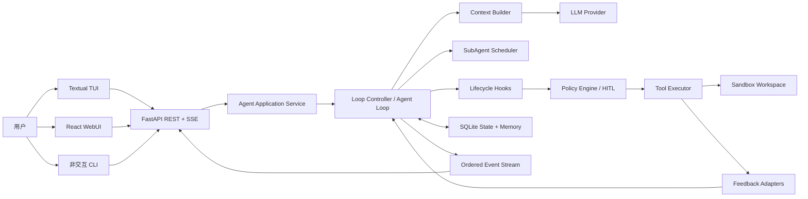

# Code-Agent 产品与系统规格

## 1. 文档信息

- 项目名称：Code-Agent
- 项目类型：Coding Agent Harness
- 规格版本：1.0
- 设计日期：2026-07-11
- 文档语言：中文
- 当前状态：设计已通过 brainstorming 逐段确认，等待书面规格复核

本规格是实现计划、测试、评审和验收的唯一产品依据。实现必须自行编码 Agent 主循环、工具分发、治理、反馈、记忆和配置，不得使用 LangChain `AgentExecutor`、AutoGen、CrewAI、LlamaIndex Agent 等高层 Agent Runner 代替核心 Harness。

## 2. 问题陈述

现有大模型可以生成代码，但单次生成无法可靠完成真实软件任务。一个可用的编码助手还需要理解仓库、调用工具、根据测试失败调整方案、限制危险操作、管理上下文、保存项目经验，并在中断后恢复。若这些行为仅依赖提示词，系统无法稳定治理，也无法在移除真实 LLM 后进行确定性测试。

Code-Agent 面向需要在本地代码仓库中完成开发工作的个人开发者与学习者。用户以自然语言描述需求，系统在指定沙箱工作区内分析代码、修改文件、执行命令、运行验证，并持续迭代，直到满足客观验收条件或达到明确停止状态。

项目的双核心贡献是：

1. **受治理的工程化反馈循环**：用代码实现 LoopSpec、Policy Engine、HITL、Hook、验证器、恢复策略和停止条件。
2. **轻量结构化项目记忆与上下文工程**：按任务和失败类型检索规则、决策与已验证经验，不依赖重型向量 RAG。

## 3. 目标与范围

### 3.1 产品目标

- 成为面向任意文本代码仓库的通用编码助手，而非只修复示例项目。
- 支持需求实现、Bug 修复、代码解释、测试补充、小型重构、配置与文档修改。
- 通过 TUI、非交互 CLI 和 React WebUI 提供一致的任务控制、观察和审批体验。
- 通过 Mock LLM 在无网络、无 API Key 的环境中确定性验证所有核心机制。
- 对任意语言提供通用文件与 Shell 能力，对主流语言生态提供开箱即用的验证适配器。

### 3.2 首版不包含

- 在线 IDE 或浏览器内代码编辑器。
- 云端多用户、账号、团队权限和项目托管。
- 大规模跨仓库自主重构。
- SubAgent 递归创建、多写 Agent 自动合并或跨 worktree 协作。
- 自动创建 PR、自动部署、自动合并主分支和强制推送。
- 定时领取 Issue、无人值守任务队列和分布式执行。
- 重型向量数据库或完整 RAG 平台。
- 为每种语言实现 AST 重写器或 LSP 深度集成。

## 4. 用户故事

1. 作为开发者，我希望输入自然语言需求并指定本地仓库，使 Agent 能实现功能并用项目测试证明结果。
2. 作为维护者，我希望 Agent 在测试失败后读取结构化反馈并改变下一步动作，而不是重复同一修改。
3. 作为安全敏感用户，我希望危险 Shell 和联网动作在执行前暂停，让我能在 CLI 或 WebUI 中审批。
4. 作为高级用户，我希望在 Plan、Supervised 和 Auto 三种模式间选择，以平衡控制力与自动化程度。
5. 作为多语言开发者，我希望 Agent 能处理任意文本代码仓库，并自动识别常见生态的测试、Lint、类型检查和构建命令。
6. 作为长期维护者，我希望 Agent 记住项目规则、历史决策和已验证经验，同时只向模型提供当前任务需要的内容。
7. 作为复杂任务的发起者，我希望主 Agent 能把探索、实现、验证和评审委派给受控 SubAgent，并只接收精简总结。
8. 作为中断任务的用户，我希望重新打开 TUI 或 WebUI 后恢复事件、预算、审批和检查点。
9. 作为自动化脚本作者，我希望使用非交互 CLI 和结构化输出运行任务，而不必启动全屏界面。
10. 作为项目维护者，我希望通过 Hook 增加项目检查，但 Hook 不能绕过核心安全策略。

## 5. 功能规约

### 5.0 模块契约总览

| 模块 | 输入 | 核心行为 | 输出 | 边界与错误处理 |
|---|---|---|---|---|
| Task Service / Loop Controller | 目标、workspace、模式、Provider、LoopSpec | 创建、运行、暂停、恢复和终止任务 | 状态、报告、检查点 | 预算耗尽、重复失败或恢复不安全时停止 |
| Context Builder | 任务、规则、代码、反馈、记忆 | 检索、排序、裁剪、压缩和脱敏 | 有预算的模型上下文 | 超限时保留目标、约束与客观证据 |
| LLM Provider | 上下文与决策 Schema | 调用 Mock 或真实 Provider 并校验输出 | `AgentDecision` | 超时有限重试；非法输出修复失败后阻塞 |
| Tool Executor | 结构化工具动作 | 边界检查后执行文件或 Shell 操作 | 标准化工具结果与事件 | 越界拒绝；超时终止；大输出截断 |
| Feedback Adapter | 工具、Hook 或用户结果 | 解析确定性信号并生成失败指纹 | `FeedbackSignal` | 无适配器时保留退出码并标记通用反馈 |
| Policy Engine / HITL | 动作、模式、规则、临时授权 | 计算 allow、ask、deny 并维护审批状态 | `PolicyDecision`、`Approval` | 硬性拒绝不可被 Hook、模式或 LLM 覆盖 |
| Hook Runner | 生命周期事件与 Hook 配置 | 顺序运行内置 Hook 和项目 Hook | 注释、反馈、阻止结果 | 受超时、输出上限、失败策略和 Policy Engine 约束 |
| Memory Store | 规则、决策、反馈、验证证据 | 事务保存并按规则检索 | 运行状态与相关长期记忆 | 未验证猜测不晋升；数据库失败不得伪造成功 |
| SubAgent Scheduler | `SubTaskSpec`、父权限与预算 | 创建隔离上下文、调度角色、汇总证据 | `SubTaskResult` | 深度、并发、写锁和父预算超限时拒绝派发 |
| API / TUI / WebUI | 用户命令、REST、SSE | 展示状态、收集任务与审批、断线恢复 | 一致的交互和事件视图 | 客户端断线不终止任务；按事件序号恢复 |

### 5.1 任务与工程化循环

**输入**：工作区路径、自然语言目标、Provider、权限模式、验收命令与预算。

**行为**：`Loop Controller` 为每个任务创建 `LoopSpec`，并运行“感知 → 决策 → 治理 → 执行 → 验证 → 反思 → 记录”的循环。`LoopSpec` 至少包含 `goal`、`acceptance_checks`、`iteration_budget`、`time_budget`、`recovery_policy`、`human_gates` 和 `terminal_states`。

**输出**：任务状态、事件流、修改摘要、Git diff、验证证据和最终报告。

**边界与错误**：LLM 不能单方面判定成功；只有验收检查或用户明确验收能结束任务。连续出现相同失败时触发恢复策略；超过轮次、时间或调用预算时进入 `budget_exhausted`。

终止状态固定为：`succeeded`、`needs_review`、`blocked`、`failed`、`budget_exhausted`、`cancelled`。

### 5.2 LLM 抽象与结构化决策

系统提供统一 `LLMProvider` 接口，并至少实现：

- `MockLLMProvider`：返回预设动作序列，用于离线测试和机制演示。
- `OpenAICompatibleProvider`：连接用户配置的 OpenAI-compatible API。

LLM 输出必须通过 Pydantic 校验为 `AgentDecision`。动作类型为 `tool_call`、`dispatch_subagent`、`request_user_input`、`complete` 和 `stop`。审批由 Policy Engine 根据动作创建，LLM 不能直接批准自己的动作。

非法输出不得执行。系统先返回结构化格式错误要求模型修复；连续失败达到配置阈值后进入 `blocked`。

### 5.3 上下文构建

`Context Builder` 按以下优先级组织上下文：任务目标和验收条件、权限与项目规则、相关代码、最近反馈、相关记忆、历史摘要。它必须：

- 按 token 和字符预算裁剪内容。
- 优先压缩旧工具输出和已完成步骤。
- 保留目标、约束、客观失败证据和未完成事项。
- 对文件内容、日志和记忆执行凭据脱敏。
- 不把数据库中的全部记忆或 SubAgent 原始 transcript 注入模型。

### 5.4 工具与语言支持

首版工具包括文件读取、目录与代码搜索、创建和修改文件、删除文件、应用补丁、Shell 命令、测试/构建命令以及 Git diff 查看。所有写操作限定在规范化后的 workspace 真实路径内。

通用能力适用于任意文本代码仓库。内置适配器覆盖：

| 生态 | 识别文件 | 典型验证方式 |
|---|---|---|
| Python | `pyproject.toml`、`requirements.txt`、`pytest.ini` | pytest、ruff、mypy |
| JavaScript/TypeScript | `package.json` | npm scripts、eslint、tsc |
| Java/Kotlin | `pom.xml`、`build.gradle` | Maven、Gradle |
| Go | `go.mod` | go test、go vet |
| Rust | `Cargo.toml` | cargo test、clippy |
| C/C++ | `CMakeLists.txt`、`Makefile` | CMake、CTest、Make |
| C# | `.sln`、`.csproj` | dotnet test、dotnet build |
| Ruby | `Gemfile` | rspec、rubocop |
| PHP | `composer.json` | PHPUnit、PHPStan |

其他生态通过 `.code-agent/config.toml` 声明 `test`、`lint`、`typecheck` 和 `build` 命令。

Git 管理不建立独立业务服务，统一通过 Shell Tool 执行。Policy Engine 识别 `git` 子命令：只读命令可自动执行；`add`、`branch`、`switch`、`stash`、`commit`、`merge`、`rebase`、`fetch`、`pull`、`push` 依据模式审批；`reset --hard`、`clean -fd` 和强制推送始终禁止。任务开始时记录原始分支、HEAD 和工作区状态，不得覆盖或撤销任务开始前已有的用户修改。

### 5.5 反馈与验收

工具原始输出经过适配器转换为 `FeedbackSignal`，字段包括来源、状态、摘要、关键证据、关联文件、失败指纹和可重试性。确定性信号优先于模型解释：退出码、失败测试、编译错误、Lint 和类型检查结果不能被 LLM 改判。

反馈管线为：

`原始结果 → 工具/语言适配器 → 结构化反馈 → 失败归类 → 记忆检索 → 下一轮上下文`

所有必需检查通过才进入 `succeeded`。缺少客观验证时只能进入 `needs_review`，等待用户验收。

### 5.6 治理、权限模式与 HITL

所有动作执行前必须经过代码实现的 `Policy Engine`，策略优先级为：硬性拒绝规则 → 当前任务权限模式 → 项目规则 → 当前任务临时授权。

| 动作 | Plan | Supervised（默认） | Auto |
|---|---|---|---|
| 读取、搜索、Git diff | 自动 | 自动 | 自动 |
| 修改工作区文件 | 禁止 | 自动 | 自动 |
| 已配置的测试与构建 | 禁止 | 自动 | 自动 |
| 普通 Shell | 禁止 | 审批 | 自动 |
| Agent 通用联网 | 禁止 | 审批 | 自动 |
| 安装或升级依赖 | 禁止 | 审批 | 自动 |
| 删除文件、Git commit | 禁止 | 审批 | 审批 |
| 越界访问、读取凭据、破坏系统、强推 | 禁止 | 禁止 | 禁止 |

审批支持“仅此次允许”和“本任务内允许同类动作”，不跨任务继承。提升权限模式需要用户确认，降低权限立即生效。CLI 与 WebUI 共用 `pending → approved/rejected → executed/failed` 状态机。

模型 Provider 是受控服务通道：用户创建任务并选择 Provider 后，允许该任务访问已确认的地址，不逐轮弹窗。首次使用自定义地址或地址变化时必须确认。Agent 自行发起的 `curl`、搜索、下载和依赖安装仍按权限表处理。

### 5.7 生命周期 Hook

Hook 点固定为 `on_task_start`、`before_tool_call`、`after_tool_call`、`on_iteration_end`、`before_task_complete` 和 `on_task_end`。

- 内置 Hook 由 Python 实现，负责反馈解析、记忆、预算、检查点和报告。
- 项目 Hook 由 `.code-agent/hooks.yaml` 声明命令，每个任务首次执行时按风险审批。
- Hook 具有超时、输出长度和失败策略。
- Hook 可以增加限制、补充反馈或阻止完成，但不能批准核心护栏拒绝的动作。

### 5.8 结构化记忆与恢复

SQLite 分开保存：

- 运行状态：轮次、预算、待审批项、最近反馈、事件游标和检查点。
- 长期记忆：项目规则、用户决策、失败模式、已验证修复经验和审批历史。

首版按 workspace、类型、标签、路径、失败指纹和时间进行规则检索，不使用向量数据库。只有用户确认的决策、确定性失败和经过验证的成功经验可以进入长期记忆。恢复时不得自动重放无法确认结果的危险动作。

### 5.9 SubAgent 调度与上下文隔离

Coordinator 通过 `dispatch_subagent(SubTaskSpec)` 派发 Explorer、Implementer、Verifier 和 Reviewer。Explorer、Verifier、Reviewer 可有限并行；默认最多同时运行 3 个子任务。同一 workspace 同时只能有一个写入者。

约束如下：

- 最大嵌套深度为 1，SubAgent 不能再创建 SubAgent。
- 子任务权限不能高于父任务，预算从父任务总预算中分配。
- 子 Agent 使用独立 `ContextEnvelope`，包含目标、角色、路径范围、规则、相关代码、反馈、验收条件、相关记忆和预算。
- 不复制父 Agent 完整对话；子 Agent 可在权限范围内自行搜索。
- 完整事件保存在 SQLite，父 Agent 默认只接收结构化 `SubTaskResult`。

`SubTaskResult` 包含状态、总结、发现、修改文件、验证证据、决策、风险、未解决事项和建议下一步。文件变化、退出码和事件编号由运行时生成，不能仅依赖 LLM 自述。只有父 Agent 接受且经验证的结果可以晋升为长期记忆。

### 5.10 TUI、CLI 与 WebUI

`code-agent` 打开 Textual TUI，包含启动页、任务运行页、审批页和结果页。启动页显示工作区、生态识别、Provider、权限模式、记忆状态、Git 状态、需求输入和最近任务。运行页展示按轮次组织的事件与预算，审批页显示动作、风险和影响，结果页显示 diff、验收证据和剩余事项。

非交互命令包括：

```text
code-agent run <workspace> "<需求>"
code-agent status <task-id>
code-agent approve <approval-id>
code-agent reject <approval-id>
code-agent resume <task-id>
code-agent attach <url>
code-agent web
```

React WebUI 是“控制台 + 观察台”，提供任务区、运行时间线和详情面板，不实现在线编辑器。TUI、非交互 CLI 和 WebUI 消费同一任务 API 与事件模型；任何一端完成审批，其他客户端必须收到状态更新。

## 6. 领域与机制设计

### 6.1 所需工具

文件系统、代码搜索、补丁编辑、Shell、验证命令和 Git 命令是 Coding Agent 的最小行动面。工具注册、参数 Schema、边界检查、执行、超时和结果回灌均由本项目代码实现。

### 6.2 客观反馈信号

反馈信号包括测试、Lint、类型检查、构建、Hook、自定义验收命令和用户拒绝理由。每种信号由确定性适配器解析；Mock LLM 测试可以注入失败，证明下一轮上下文和动作发生变化。

### 6.3 危险动作

危险动作包括越界文件访问、删除或批量覆盖、任意 Shell、联网、依赖安装、敏感配置修改和高风险 Git 命令。路径解析、命令分类、权限模式和审批状态机必须用代码实现，不以提示词代替。

### 6.4 记忆需求

跨会话需要保留项目规则、用户决策、失败模式、有效修复、命令约定和审批历史。检索必须按需进行，避免全量载入和未经验证的模型猜测污染记忆。

### 6.5 深入维度

项目同时深入治理/反馈与记忆/上下文两个方向。Loop Engineering、Policy Engine、HITL、Hook、失败指纹、恢复策略和终止状态构成受治理反馈循环；规则检索、上下文预算、SubAgent 隔离与总结晋升构成结构化项目记忆。二者通过确定性代码机制结合，而不是依赖更长的 Prompt。

## 7. 系统架构



系统采用单机模块化单体。FastAPI 是共享任务服务，TUI 可启动本地服务或通过 `attach` 连接已有服务。首版不引入消息队列和分布式服务。

### 7.1 任务数据流

1. 客户端提交 workspace、目标、模式、Provider、验收命令和预算。
2. Application Service 创建 Task、LoopSpec 和初始检查点。
3. Context Builder 组合目标、规则、代码、反馈和相关记忆。
4. LLM 返回结构化决策，或 Coordinator 派发受控 SubAgent。
5. Hook 与 Policy Engine 检查动作，必要时进入 HITL。
6. Tool Executor 在 workspace 边界内执行并生成事件。
7. Feedback Adapter 解析客观结果，更新运行状态与可晋升记忆。
8. Loop Controller 判断继续、恢复、等待用户或终止。

## 8. 数据模型

| 实体 | 关键字段 | 约束与关系 |
|---|---|---|
| Task | id、workspace、goal、mode、provider、status、budgets | 一个 Task 有多个 Iteration、Event、Approval、SubTask |
| LoopSpec | task_id、acceptance_checks、recovery_policy、terminal_states | 与 Task 一对一，创建后变更需记录事件 |
| Iteration | id、task_id、sequence、context_summary、decision、status | sequence 在任务内唯一递增 |
| ToolCall | id、iteration_id、tool、arguments、risk、result | 执行前必须有 PolicyDecision |
| PolicyDecision | tool_call_id、outcome、reason、rule | outcome 为 allow、ask、deny |
| Approval | id、tool_call_id、status、scope、reason、actor | 决定不可覆盖，只能追加新记录 |
| FeedbackSignal | id、source、status、evidence、fingerprint、retryable | 必须引用 ToolCall、Hook 或用户事件 |
| MemoryEntry | id、workspace、type、tags、content、evidence、verified_at | 未验证内容不可写入长期记忆 |
| SubTask | id、parent_task_id、role、spec、budget、status | 深度固定为 1，受 workspace 写锁约束 |
| Event | id、task_id、sequence、type、payload、created_at | sequence 单调递增，供 SSE 重放 |
| Checkpoint | task_id、iteration、budgets、pending_action、event_cursor | 事务写入，危险动作结果不明时不得重放 |

核心循环通过仓储接口访问数据，测试可替换为内存实现。

## 9. API 与配置

主要 API：

```text
POST /api/tasks
GET  /api/tasks/{id}
POST /api/tasks/{id}/cancel
POST /api/tasks/{id}/resume
GET  /api/tasks/{id}/events
POST /api/approvals/{id}/decision
GET  /api/tasks/{id}/diff
GET  /api/tasks/{id}/report
```

事件接口使用 SSE，并支持通过最后事件序号恢复。配置优先级为：命令行参数 > 环境变量 > 项目配置 > 默认配置。配置文件不得包含真实密钥。

## 10. 凭据与安全设计

### 10.1 威胁模型

主要风险是密钥被提交到 Git、进入日志/终端历史、注入模型上下文、被 Agent 执行的子进程读取、通过恶意 Provider 地址泄露，或由远程客户端未授权访问本地任务。

### 10.2 凭据存储与生命周期

首选使用 Python `keyring` 对接 Windows Credential Manager、macOS Keychain 和 Linux Secret Service。服务名为 `code-agent`，账户键由 Provider 标识组成。

```text
code-agent auth set <provider>     # getpass 隐藏输入并写入系统钥匙串
code-agent auth status <provider>  # 只显示是否已配置
code-agent auth clear <provider>   # 从系统钥匙串清除
```

环境变量和被 `.gitignore` 排除的 `.env` 只作为开发回退，并在文档中明确其明文与进程可见风险。API Key 不得出现在命令参数、项目配置、SQLite、事件、报告、Prompt 和 Shell history 中。

若 Linux 环境未提供 Secret Service 或可用的 `keyring` 后端，系统必须明确提示安装安全后端或由用户显式启用开发回退，不能静默把密钥写入明文文件。本地 API 的访问令牌也使用同一钥匙串机制保存。

Provider Adapter 在 HTTP 传输层读取密钥；Tool Executor 启动子进程时移除所有 Provider 密钥环境变量。日志和上下文在持久化前执行模式匹配与已知密钥值脱敏。Provider 地址由用户配置，非本机地址必须使用 HTTPS；首次自定义地址需要确认。

### 10.3 服务与工具安全

- API 默认只监听 `127.0.0.1`。
- 显式监听非回环地址时必须配置访问令牌与允许来源。
- workspace 使用真实路径和符号链接解析进行边界检查。
- 同一 workspace 同时只允许一个写任务。
- 工具具有超时、输出上限、文件大小上限和清理逻辑。
- 模型 API 受控出站连接与 Agent 通用网络工具相互隔离。

## 11. 技术选型与理由

| 层 | 选型 | 理由 |
|---|---|---|
| Harness 后端 | Python 3.12+ | LLM、测试、CLI 与跨平台工具生态成熟，适合快速实现可测试机制 |
| API | FastAPI + Pydantic | 异步支持、Schema 校验和 OpenAPI 能力适合结构化 Agent 事件 |
| 持久化 | SQLite + SQLAlchemy | 本地优先、单文件分发、事务和可迁移 Schema |
| TUI | Textual + Rich | 原生 Screen/Widget/异步事件，适合启动页、时间线和审批对话框 |
| Web | React + Vite + TypeScript | 适合事件驱动控制台，开发与测试工具成熟 |
| 通信 | REST + SSE | 控制请求简单，单向实时事件无需 WebSocket 复杂度 |
| 测试 | pytest、Vitest、React Testing Library、Playwright | 覆盖核心机制、组件和端到端界面 |
| 分发 | Python wheel / PyPI 兼容包，推荐 pipx | 满足跨平台 CLI/TUI 安装并能打包 Web 静态资源 |

### 11.1 Open Design

WebUI 设计阶段使用 Open Design 的 Codex MCP/skills 工作流，以其 Linear 风格设计系统作为起点，并生成仓库级 `DESIGN.md` 品牌契约。契约必须明确色彩、字体、间距、信息密度、动效、语气和反模式。设计目标是安静、紧凑、适合长时间扫描的开发工具控制台，而不是营销页面。

Open Design 只用于设计与产出可评审原型，不作为应用运行时依赖。原型经用户确认后再实现 React 组件，并通过桌面与移动视口截图进行视觉回归验证。

## 12. 非功能性需求

- **性能**：普通事件产生后 1 秒内显示到已连接客户端；大输出截断并保留摘要与原始工件引用。
- **可靠性**：客户端断开不终止任务；事件按序重放；检查点事务写入。
- **可测试性**：移除真实 LLM 后，主循环、工具、治理、反馈、记忆、Hook、SubAgent 和停止条件均可单测。
- **可观测性**：每轮决策、策略判断、工具结果、反馈、记忆命中、预算与审批均形成结构化事件。
- **兼容性**：目标平台为 Windows、Linux、macOS；Shell 与进程终止由平台适配器处理。
- **可用性**：TUI 和 WebUI 使用相同术语与状态；审批等待必须显式展示，不能静默阻塞。
- **可维护性**：组件通过接口隔离；核心循环不得依赖 FastAPI、Textual、React 或 SQLAlchemy 具体实现。

## 13. 异常处理

- LLM 超时或限流：有限次数退避重试，耗尽后进入 `blocked`。
- 工具超时：终止进程树，记录截断输出并生成失败反馈。
- Hook 失败：按配置警告、阻止动作或阻止完成。
- SSE/TUI 断开：任务继续，客户端按事件序号恢复。
- 进程崩溃：从检查点恢复，不重放结果未知的危险动作。
- 相同失败重复：触发反思与策略切换，达到阈值后停止。
- 工作区出现来源不明的并发修改：暂停写入并请求用户处理。

## 14. 测试与机制演示

开发严格采用 TDD：先写失败测试并确认红色结果，再写最小实现使其通过，最后重构。

测试层次：

1. 核心单元测试：Mock LLM 驱动 Agent Loop、LoopSpec、预算、上下文与终止状态。
2. 机制测试：Policy Engine、HITL、Hook、反馈分类、记忆检索、恢复与 SubAgent 总结。
3. 集成测试：临时多语言 workspace、Shell、SQLite、API 与 SSE。
4. 界面测试：React 关键流程、Textual Screen、审批、断线恢复和 Playwright 视觉检查。

课程要求的确定性演示固定为：

- 护栏阻止 workspace 越界或硬性禁止命令。
- Mock LLM 第一次执行后收到注入的测试失败，并在第二轮采取不同动作直至通过。
- 结构化记忆改变后续上下文，或 Hook 阻止不满足验收条件的完成。
- Coordinator 派发 SubAgent，父 Agent 只收到 `SubTaskResult`，且权限与预算正确继承。

真实 Provider 测试为可选集成测试，不进入默认 CI。

## 15. 分发、CI 与部署

项目以 Python 包分发，推荐安装命令为 `pipx install code-agent`。包内包含已构建的 React 静态资源；`code-agent web` 启动 FastAPI 并默认提供 `http://127.0.0.1:8000`。Docker 可作为后续附加分发方式，不是首版完成条件。

CI 包含：

- GitHub Actions：后端测试、前端测试、类型检查、构建、凭据扫描和包构建。
- `.gitlab-ci.yml`：必须包含名为 `unit-test` 的 job，以满足课程提交要求。
- 默认 CI 使用 Mock LLM，不依赖网络和真实密钥。

最终提交前提供可访问 WebUI URL；部署环境使用平台 Secret 管理凭据，不把密钥写入镜像或仓库。

## 16. 验收标准

1. TUI、非交互 CLI 和 WebUI 能创建并观察同一任务模型。
2. Agent 能在任意文本仓库中读写代码，并对至少 Python、TypeScript、Go 和 Java fixture 自动识别验证命令。
3. 功能实现、Bug 修复、测试补充和小型重构各有一个可重复演示任务。
4. Mock LLM 能完整运行主循环，且无网络、无 API Key。
5. 客观失败反馈会改变下一轮动作；LLM 声称完成但检查失败时循环继续。
6. 三种权限模式的策略矩阵有确定性测试，硬性禁止动作在 Auto 模式仍被拦截。
7. CLI 和 WebUI 均能审批动作，并同步看到审批结果。
8. 项目 Hook 能追加验证并阻止任务完成，但不能绕过 Policy Engine。
9. 任务中断后恢复事件、预算、记忆、检查点和待审批状态。
10. SubAgent 权限不高于父任务、共享父预算、深度不超过 1，且父 Agent 默认只接收总结。
11. 系统钥匙串支持密钥录入、状态查看、更新和清除，日志与子进程不泄露密钥。
12. `pipx` 安装后的 `code-agent`、`code-agent web` 和一键测试命令可在干净环境运行。
13. GitHub Actions 与 GitLab `unit-test` job 通过，公开 WebUI 地址可访问。

## 17. 风险与后续方向

### 17.1 已识别风险与控制

- 模型输出不稳定：严格 Schema、格式修复、Mock LLM 和客观验证器。
- 循环失控：轮次、时间、调用量、SubAgent 和重复失败预算。
- Shell 无法提供绝对系统隔离：硬性规则、环境清理、workspace 边界和可选 Docker 沙箱。
- 多语言质量不一致：通用文本能力兜底，主流生态适配器逐步增强。
- TUI 与 WebUI 工作量过大：共享 API、事件和状态机，只实现核心控制台页面。
- Auto 模式误操作：限制 workspace，删除、提交和硬性危险动作不自动放行。
- SubAgent 信息损失：保留原始事件和证据引用，允许父 Agent 按需读取，但默认只注入总结。
- 用户已有改动被覆盖：任务启动快照、单写锁和来源不明修改暂停机制。

### 17.2 后续版本候选

在首版验收完成后，再评估 worktree 多写 Agent、独立模型 Verifier、LSP/AST 工具、GitHub/GitLab PR 集成、Docker 强沙箱、向量检索、计划任务和远程队列。这些候选不进入首版实施计划。
